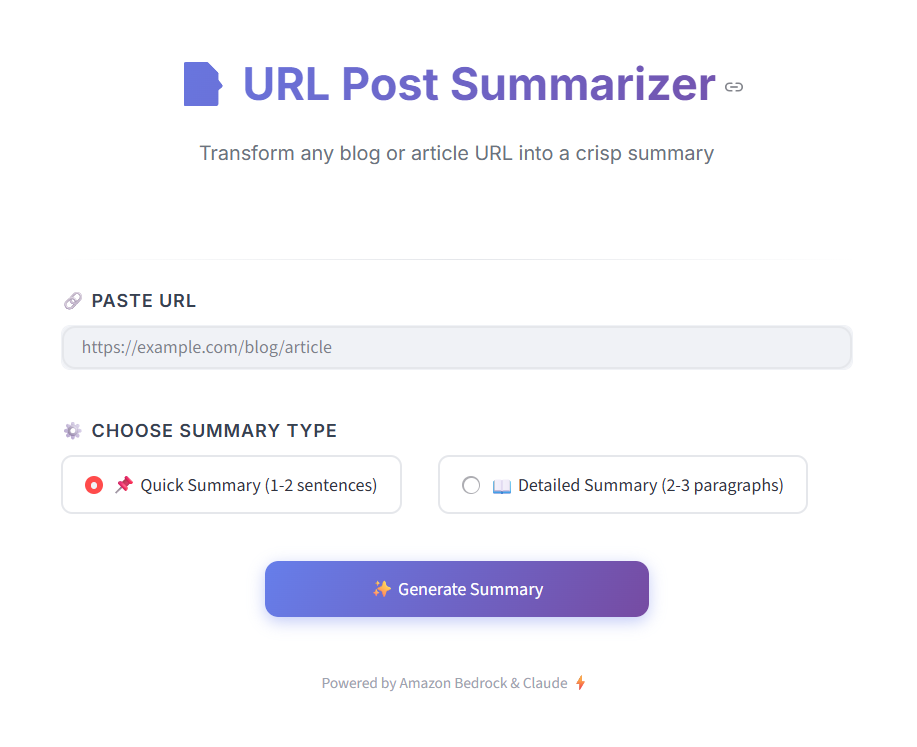
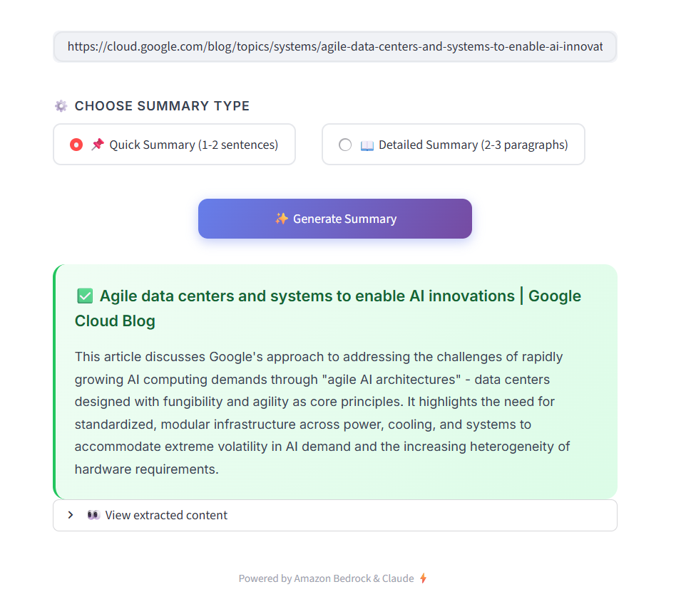
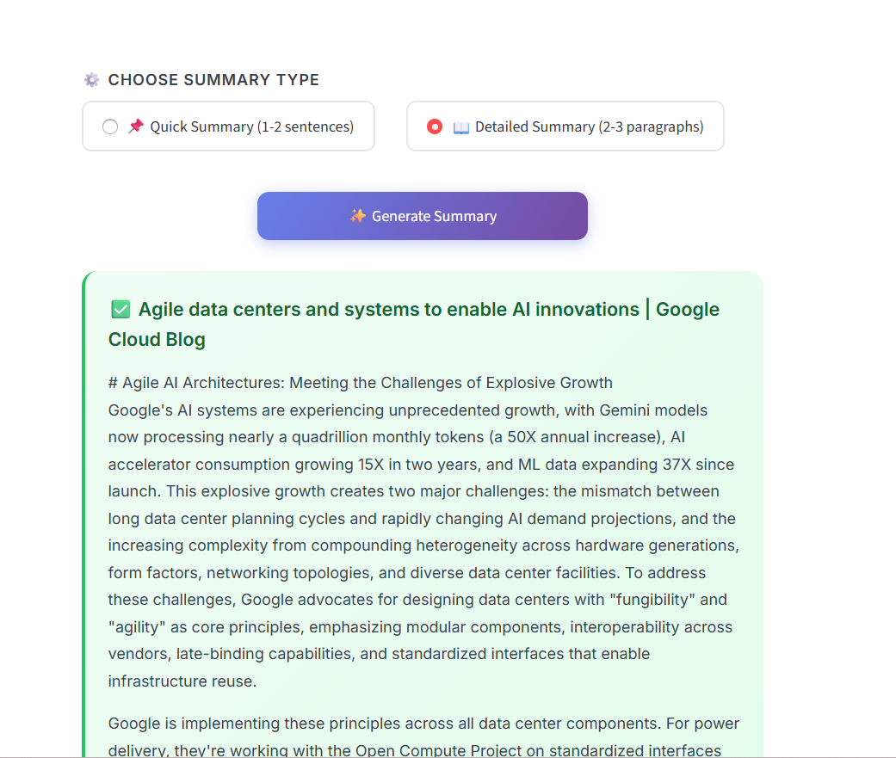

# 📝 Content Summarizer

An AI-powered web application that transforms any blog post, article, or online content into concise summaries using Amazon Bedrock and Claude.

---

## 1. Problem & Solution

### The Problem
In today's information-rich digital landscape, professionals, researchers, and students face significant challenges:
- **Information Overload**: Thousands of articles, blog posts, and publications are published daily
- **Time Constraints**: Reading full articles is time-consuming, especially when evaluating relevance
- **Content Evaluation**: Difficult to quickly assess if an article is worth a deeper read
- **Knowledge Curation**: Summarizing content manually for notes or sharing is tedious

### The Solution
**Content Summarizer** is a web application that:
- Takes any public URL (blog post, article, news piece)
- Automatically extracts the main content from the webpage
- Uses AI to generate intelligent summaries in two formats:
  - **Quick Summary**: 1-2 sentence overview for rapid assessment
  - **Detailed Summary**: 2-3 paragraph comprehensive breakdown

### Who Benefits?
| User Type | Benefit |
|-----------|---------|
| **Researchers** | Quickly evaluate academic articles and publications |
| **Students** | Summarize reading materials for study notes |
| **Professionals** | Stay updated on industry news without reading full articles |
| **Content Curators** | Efficiently summarize content for newsletters or social media |
| **Business Analysts** | Extract key insights from competitor blogs and market reports |

---

## 2. Technical Implementation

### AWS Services Used

| Service | Purpose | Why This Service? |
|---------|---------|-------------------|
| **Amazon Bedrock** | AI/ML inference | Provides managed access to foundation models without infrastructure management |
| **Claude 3.5 Sonnet** | Text summarization | State-of-the-art language model with excellent comprehension and summarization capabilities |

### System Architecture

```
┌─────────────────┐     ┌──────────────────┐     ┌─────────────────┐
│                 │     │                  │     │                 │
│   User Browser  │────▶│  Streamlit App   │────▶│  Target Website │
│                 │     │                  │     │                 │
└─────────────────┘     └────────┬─────────┘     └─────────────────┘
                                 │
                                 │ Content + Prompt
                                 ▼
                        ┌──────────────────┐
                        │                  │
                        │  Amazon Bedrock  │
                        │  (Claude 3.5)    │
                        │                  │
                        └──────────────────┘
```

### How The System Works

1. **URL Input**: User provides a URL to any public blog/article
2. **Content Extraction**: 
   - HTTP request fetches the webpage
   - BeautifulSoup parses HTML and extracts main content
   - Removes navigation, ads, scripts, and irrelevant elements
3. **AI Processing**:
   - Extracted content is sent to Amazon Bedrock
   - Claude 3.5 Sonnet generates summary based on selected type
4. **Result Display**: Summary is presented in a clean, readable format

### Tech Stack

```
Frontend:       Streamlit (Python web framework)
Backend:        Python 3.x
AI/ML:          Amazon Bedrock + Claude 3.5 Sonnet
Web Scraping:   BeautifulSoup4 + Requests
Cloud:          AWS (Bedrock Runtime)
```

---

## 3. Scaling Strategy

### Current Capacity

| Metric | Current State |
|--------|---------------|
| **Concurrent Users** | Single-instance deployment |
| **Request Handling** | Sequential processing |
| **Model** | Claude 3.5 Sonnet (via Bedrock on-demand) |
| **Content Limit** | ~15,000 characters per article |

### Future Growth Plans

#### Phase 1: Enhanced Features
- [ ] Support for PDF documents
- [ ] Multiple language support
- [ ] Custom summary length options
- [ ] Export summaries to different formats (PDF, Markdown, etc.)

#### Phase 2: Scalability Improvements
- [ ] Deploy on AWS ECS/Fargate for container orchestration
- [ ] Add Amazon ElastiCache for caching frequently summarized URLs
- [ ] Implement Amazon SQS for async processing of large documents
- [ ] Add CloudFront CDN for global distribution

#### Phase 3: Enterprise Features
- [ ] User authentication via Amazon Cognito
- [ ] Usage tracking and analytics with CloudWatch
- [ ] API Gateway for external integrations
- [ ] Batch processing for multiple URLs

### Proposed Scalable Architecture

```
                                    ┌─────────────────┐
                                    │   CloudFront    │
                                    │      CDN        │
                                    └────────┬────────┘
                                             │
┌─────────────┐                    ┌─────────▼────────┐
│   Cognito   │◀───────────────────│   Application   │
│    Auth     │                    │  Load Balancer  │
└─────────────┘                    └────────┬────────┘
                                            │
                    ┌───────────────────────┼───────────────────────┐
                    │                       │                       │
           ┌────────▼────────┐    ┌────────▼────────┐    ┌────────▼────────┐
           │   ECS/Fargate   │    │   ECS/Fargate   │    │   ECS/Fargate   │
           │   Container 1   │    │   Container 2   │    │   Container N   │
           └────────┬────────┘    └────────┬────────┘    └────────┬────────┘
                    │                       │                       │
                    └───────────────────────┼───────────────────────┘
                                            │
                    ┌───────────────────────┼───────────────────────┐
                    │                       │                       │
           ┌────────▼────────┐    ┌────────▼────────┐    ┌────────▼────────┐
           │   ElastiCache   │    │ Amazon Bedrock  │    │    DynamoDB     │
           │    (Redis)      │    │  (Claude 3.5)   │    │   (History)     │
           └─────────────────┘    └─────────────────┘    └─────────────────┘
```

---

## 4. Visual Documentation

### Application Screenshots

#### Main Interface
The clean, modern UI allows users to:
- Paste any URL
- Choose between quick or detailed summaries
- Generate AI-powered summaries with one click



#### Summary Result





### Architecture Diagram

```
┌──────────────────────────────────────────────────────────────────┐
│                        USER INTERFACE                            │
│  ┌────────────────────────────────────────────────────────────┐ │
│  │                    Streamlit Web App                        │ │
│  │  • URL Input        • Summary Type Selection               │ │
│  │  • Result Display   • Content Preview                      │ │
│  └────────────────────────────────────────────────────────────┘ │
└──────────────────────────────────────────────────────────────────┘
                                │
                                ▼
┌──────────────────────────────────────────────────────────────────┐
│                      CONTENT EXTRACTION                          │
│  ┌────────────────────────────────────────────────────────────┐ │
│  │                content_summarizer_lib.py                    │ │
│  │  • fetch_content_from_url() - HTTP requests + parsing      │ │
│  │  • get_title_from_url() - Extract page title               │ │
│  │  • BeautifulSoup HTML parsing                              │ │
│  └────────────────────────────────────────────────────────────┘ │
└──────────────────────────────────────────────────────────────────┘
                                │
                                ▼
┌──────────────────────────────────────────────────────────────────┐
│                        AWS CLOUD                                 │
│  ┌────────────────────────────────────────────────────────────┐ │
│  │                   Amazon Bedrock                            │ │
│  │  ┌──────────────────────────────────────────────────────┐  │ │
│  │  │            Claude 3.5 Sonnet Model                   │  │ │
│  │  │  • Natural language understanding                    │  │ │
│  │  │  • Intelligent summarization                         │  │ │
│  │  │  • Context-aware content analysis                    │  │ │
│  │  └──────────────────────────────────────────────────────┘  │ │
│  └────────────────────────────────────────────────────────────┘ │
└──────────────────────────────────────────────────────────────────┘
```

---

## 5. Code & Resources

### GitHub Repository

🔗 **Source Code**: [https://github.com/aakarshsak/ai-for-bharat/tree/master/workshop1-content-summarizer](https://github.com/aakarshsak/ai-for-bharat/tree/master/workshop1-content-summarizer)

### Project Structure

```
homework/
├── content_summarizer_app.py    # Main Streamlit app
├── content_summarizer_lib.py    # Backend logic & AWS integration
├── styles.py                    # CSS styles
├── ui_components.py             # HTML components
├── requirements.txt             # Python dependencies
├── screenshots/                 # App screenshots
└── README.md                    # This documentation
```

### Key Code Snippets

#### Content Extraction (content_summarizer_lib.py)

```python
HEADERS = {
    'User-Agent': 'Mozilla/5.0 (Windows NT 10.0; Win64; x64) AppleWebKit/537.36'
}

CONTENT_SELECTORS = [
    'article', '[role="main"]', '.post-content', '.article-content',
    '.entry-content', '.content', 'main', '.blog-post', '.post-body'
]

def fetch_content(url):
    """Fetch and extract text content from a URL"""
    resp = requests.get(url, headers=HEADERS, timeout=15)
    resp.raise_for_status()
    
    soup = BeautifulSoup(resp.content, 'html.parser')
    
    # Remove junk elements
    for tag in soup(['script', 'style', 'nav', 'footer', 'header', 'aside']):
        tag.decompose()
    
    # Find main content
    content = None
    for selector in CONTENT_SELECTORS:
        content = soup.select_one(selector)
        if content:
            break
    
    if not content:
        content = soup.body or soup
    
    text = content.get_text(separator='\n', strip=True)
    return text
```

#### AI Summarization with Amazon Bedrock

```python
def get_summary(content, summary_type):
    """Generate summary using Bedrock"""
    if summary_type == "one_line":
        prompt = f"Give a 1-2 sentence summary of this:\n\n{content}"
    else:
        prompt = f"Summarize this in 2-3 paragraphs, covering the main points:\n\n{content}"

    bedrock = boto3.Session().client('bedrock-runtime')
    
    response = bedrock.converse(
        modelId="us.anthropic.claude-3-7-sonnet-20250219-v1:0",
        messages=[{"role": "user", "content": [{"text": prompt}]}],
        inferenceConfig={"maxTokens": 1000, "temperature": 0.3}
    )
    
    return response['output']['message']['content'][0]['text']
```

#### Streamlit UI (content_summarizer_app.py)

```python
import streamlit as st
import content_summarizer_lib as glib
from styles import CSS
from ui_components import HEADER, DIVIDER, FOOTER, section_label, summary_card, error_card

st.set_page_config(page_title="Content Summarizer", page_icon="📝", layout="centered")
st.markdown(CSS, unsafe_allow_html=True)

# URL input
url = st.text_input("URL", placeholder="https://example.com/blog/article")

# Summary type selection
summary_type = st.radio(
    "Type",
    ["one_line", "detailed"],
    format_func=lambda x: "📌 Quick Summary (1-2 sentences)" if x == "one_line" 
                          else "📖 Detailed Summary (2-3 paragraphs)",
    horizontal=True
)

# Handle submission
if st.button("✨ Generate Summary", type="primary"):
    with st.spinner("Fetching and summarizing..."):
        result = glib.summarize_url(url, summary_type)
        st.markdown(summary_card(result['title'], result['summary']), unsafe_allow_html=True)
```


### AWS Permissions Required

Ensure your AWS IAM user/role has the following permissions:

```json
{
    "Version": "2012-10-17",
    "Statement": [
        {
            "Effect": "Allow",
            "Action": [
                "bedrock:InvokeModel",
                "bedrock:Converse"
            ],
            "Resource": "*"
        }
    ]
}
```

